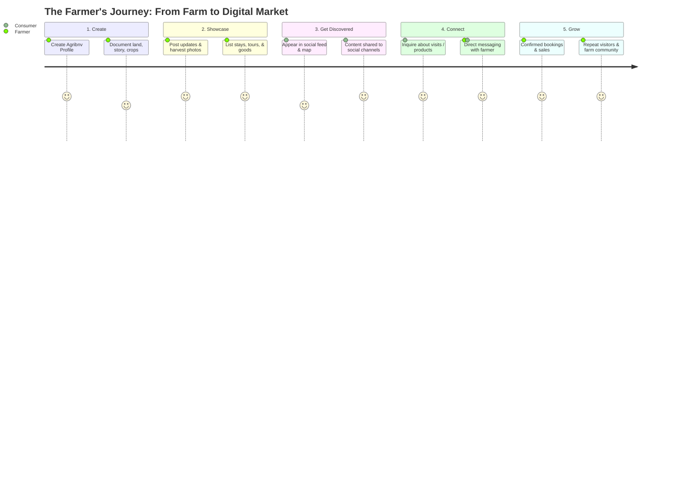

# Agribnv v2: Product Vision & Strategic Context

> **Status:** Working Draft (Awaiting Client Outline)  
> **Source Material:** Official Agribnv Pitch Deck ("Agribnv: Marketing Strategy & Direction — bed & venture")  
> **Last Updated:** September 2026  

---

## 1. Executive Summary & Strategic Pivot

### The Shift: From Transactional Booking to Social-First Agritourism
Agribnv is evolving from a traditional **transactional rental marketplace** (an Airbnb-style listing engine) into a **social-first agricultural community and discovery platform** that retains full booking and marketplace capabilities.

* **Previous Model (v1):** Search $\rightarrow$ Filter $\rightarrow$ Pick Dates $\rightarrow$ Book Stay. Farms were static rental inventory.
* **New Model (v2 — "Bed & Venture"):** Discover Stories $\rightarrow$ Follow Farmers $\rightarrow$ Learn How Food is Grown $\rightarrow$ Book Stays, Tours, & Buy Direct Farm Products.

### Core Tagline & Brand Identity
* **Tagline:** *"Your Farm. Your Story. Your Market."*
* **Brand Subtitle:** *"bed & venture"*
* **Mission:** *"Helping Farmers bring their farms, products, and stories to the Digital Market."*
* **The Problem It Solves:** Farmers have exceptional land, heritage, organic harvests, and hands-on skills, but their biggest hurdle is **getting discovered**. Agribnv serves as their digital home: **Farm $\longrightarrow$ Digital Presence $\longrightarrow$ Market**.

---

## 2. The Four Pillars of Agribnv v2

According to the official pitch, Agribnv provides **"One Digital Tool. Multiple Opportunities."** It connects farmers directly to consumers across four distinct avenues:

```
┌─────────────────────────────────────────────────────────────────────────────┐
│                             AGRIBNV PLATFORM                                │
├───────────────────┬───────────────────┬───────────────────┬─────────────────┤
│  1. FARM PROFILE  │    2. PRODUCTS    │  3. EXPERIENCES   │  4. SOCIAL &    │
│    (Identity)     │    (Commerce)     │   (Hospitality)   │    MARKETING    │
├───────────────────┼───────────────────┼───────────────────┼─────────────────┤
│ • Farm story      │ • Fresh harvests  │ • Farm visits     │ • Digital home  │
│ • Farmer bio/why  │ • Specialty goods │ • Harvesting runs │ • Story updates │
│ • Location & map  │ • Local processed │ • Planting days   │ • Follow/Feed   │
│ • "What you grow" │   items (honey,   │ • Animal sessions │ • Social share  │
│ • Photos & land   │   coffee, oils)   │ • Workshops       │ • Direct bridge │
│   information     │ • Direct inquiry  │ • Farm stays      │   to consumers  │
└───────────────────┴───────────────────┴───────────────────┴─────────────────┘
```

### 1. Farm Profile (The Digital Identity)
* Each farm has a rich, living identity page rather than a dry rental checklist.
* Highlights the farmer behind the land (WHO), their ethos and sustainable practices (WHY), the geography/terroir (WHERE), and their seasonal crop rotations (WHAT).

### 2. Products (Direct Farm Offerings)
* Direct-to-consumer agricultural goods (fruits, heritage rice, honey, artisan cheeses, roasted coffee, seedlings).
* Allows visitors to support farms even when not staying overnight, and lets past guests reorder farm goods.

### 3. Experiences ("The Venture") & Stays ("The Bed")
* **Day Experiences:** Tree planting, mango picking, beekeeping workshops, eco-trails, educational farm tours.
* **Overnight Stays:** Kubo huts, eco-cottages, agrifarm homestays, camp stays.
* Retains the full reservation engine, date pickers, calendar availability, and PostgreSQL atomic GiST booking constraints built in v1.

### 4. Social & Content Marketing Layer (The Discovery Engine)
* **The Hook:** *"The content gets people interested. Agribnv gives them somewhere to go next."*
* Content types: Seasonal harvest updates, behind-the-scenes farm journals, photo/video reels of daily farm life.
* Enables urban consumers, culinary enthusiasts, and eco-travelers to follow their favorite farms and be notified when harvests or workshops open.

---

## 3. The Farmer & Consumer Journeys



---

## 4. Software Architecture Implications

To transition to a social-marketplace hybrid while retaining our robust booking infrastructure, the technical roadmap must accommodate:

### 1. What We Retain (The Core Engine)
* **Bookings & Availability:** PostgreSQL GiST exclusion constraint (`no_overlapping_bookings`) preventing double bookings.
* **Role Management:** `user_roles` (Guest vs. Host/Farmer).
* **Native Mobile Bridge:** Capacitor wrappers for iOS and Android (`/ios`, `/android`).
* **Supabase Integration:** Realtime subscriptions, Auth, Storage, and Edge Functions.

### 2. What We Expand (The Social & Content Layer)
* **Activity & Story Feed:** Feed mechanism where farmers publish updates (photos, harvest alerts, seasonal workshops) and consumers interact (likes, bookmarks, comments).
* **Follow System:** Ability for guests to "Follow" farms and get a personalized feed of updates.
* **Integrated Product Showcase:** Dedicated catalog tab on farm profiles linking goods directly to the farmer.
* **Content Sharing:** Deep links and Web Share API integrations to easily share a farm's story to Instagram, Facebook, and TikTok.

---

## 5. Client Alignment & Pending Outline Checklist

> [!IMPORTANT]
> The development team is currently waiting on the client's detailed feature outline. Once provided, the following specific architectural questions will be locked in:

- [ ] **Content Format Specification:** Will the social feed focus on short-form photo/journal cards, vertical video/reels, or micro-blog updates?
- [ ] **E-Commerce Scope:** Are farm products sold via in-app payment/shipping, or initial inquiry/pick-up during farm visits?
- [ ] **Feed Structure:** Will the main home screen open directly to a social discovery feed (like Instagram/TikTok) with an Explore/Map tab, or an Airbnb-style search hero with an embedded social feed?
- [ ] **Creator Tools for Farmers:** Mobile-first photo/story upload interface with offline draft caching for rural areas with spotty connectivity.

---
*This document serves as the foundational product context for the `revamp/v2` branch.*
