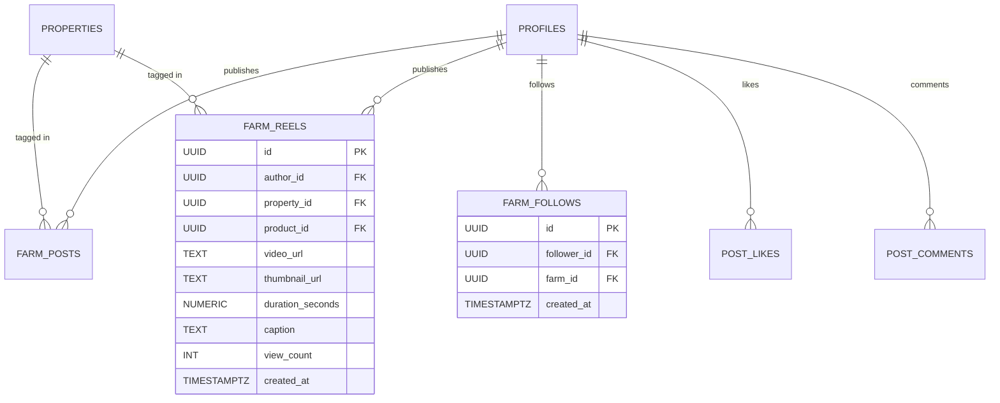

# SPEC-001: Social Feed, Reels & Creator Architecture

**Specification ID:** SPEC-001  
**Category:** Frontend Architecture, Database Schema, Media Streaming  
**Status:** Approved  
**Related Documents:** [`SRS.md`](file:///Users/Kyle/Desktop/Claude/Agribnv/agribnv-demo/SRS.md), [`docs/prd/PRD-001-social-feed-and-reels.md`](file:///Users/Kyle/Desktop/Claude/Agribnv/agribnv-demo/docs/prd/PRD-001-social-feed-and-reels.md)  

---

## 1. Database Schema Architecture

The social layer adds 5 relational tables to Supabase, strictly integrated with existing `profiles`, `properties`, and `user_roles`.



### SQL Migration Definition

```sql
-- 1. Farm Reels Table (Short-Form Video)
CREATE TABLE public.farm_reels (
    id UUID PRIMARY KEY DEFAULT gen_random_uuid(),
    author_id UUID REFERENCES auth.users(id) ON DELETE CASCADE NOT NULL,
    property_id UUID REFERENCES public.properties(id) ON DELETE SET NULL,
    product_id UUID REFERENCES public.products(id) ON DELETE SET NULL,
    video_url TEXT NOT NULL,
    thumbnail_url TEXT NOT NULL,
    duration_seconds DECIMAL(5, 2) NOT NULL CHECK (duration_seconds <= 60),
    caption TEXT,
    view_count INTEGER NOT NULL DEFAULT 0,
    created_at TIMESTAMPTZ NOT NULL DEFAULT now(),
    updated_at TIMESTAMPTZ NOT NULL DEFAULT now()
);

-- 2. Farm Posts Table (Photo Journals & Story Updates)
CREATE TABLE public.farm_posts (
    id UUID PRIMARY KEY DEFAULT gen_random_uuid(),
    author_id UUID REFERENCES auth.users(id) ON DELETE CASCADE NOT NULL,
    property_id UUID REFERENCES public.properties(id) ON DELETE SET NULL,
    product_id UUID REFERENCES public.products(id) ON DELETE SET NULL,
    media_urls TEXT[] NOT NULL DEFAULT '{}',
    caption TEXT NOT NULL,
    crop_tags TEXT[] DEFAULT '{}',
    created_at TIMESTAMPTZ NOT NULL DEFAULT now(),
    updated_at TIMESTAMPTZ NOT NULL DEFAULT now()
);

-- 3. Social Follows Graph
CREATE TABLE public.farm_follows (
    id UUID PRIMARY KEY DEFAULT gen_random_uuid(),
    follower_id UUID REFERENCES auth.users(id) ON DELETE CASCADE NOT NULL,
    farm_id UUID REFERENCES auth.users(id) ON DELETE CASCADE NOT NULL,
    created_at TIMESTAMPTZ NOT NULL DEFAULT now(),
    UNIQUE (follower_id, farm_id),
    CONSTRAINT no_self_follow CHECK (follower_id != farm_id)
);

-- 4. Unified Likes Table
CREATE TABLE public.post_likes (
    id UUID PRIMARY KEY DEFAULT gen_random_uuid(),
    user_id UUID REFERENCES auth.users(id) ON DELETE CASCADE NOT NULL,
    post_id UUID REFERENCES public.farm_posts(id) ON DELETE CASCADE,
    reel_id UUID REFERENCES public.farm_reels(id) ON DELETE CASCADE,
    created_at TIMESTAMPTZ NOT NULL DEFAULT now(),
    CONSTRAINT target_exists CHECK (
        (post_id IS NOT NULL AND reel_id IS NULL) OR
        (post_id IS NULL AND reel_id IS NOT NULL)
    ),
    UNIQUE (user_id, post_id),
    UNIQUE (user_id, reel_id)
);

-- 5. Unified Comments Table
CREATE TABLE public.post_comments (
    id UUID PRIMARY KEY DEFAULT gen_random_uuid(),
    user_id UUID REFERENCES auth.users(id) ON DELETE CASCADE NOT NULL,
    post_id UUID REFERENCES public.farm_posts(id) ON DELETE CASCADE,
    reel_id UUID REFERENCES public.farm_reels(id) ON DELETE CASCADE,
    content TEXT NOT NULL CHECK (char_length(content) BETWEEN 1 AND 500),
    created_at TIMESTAMPTZ NOT NULL DEFAULT now(),
    CONSTRAINT target_exists CHECK (
        (post_id IS NOT NULL AND reel_id IS NULL) OR
        (post_id IS NULL AND reel_id IS NOT NULL)
    )
);

-- Performance Indexes
CREATE INDEX idx_reels_author_created ON public.farm_reels (author_id, created_at DESC);
CREATE INDEX idx_posts_author_created ON public.farm_posts (author_id, created_at DESC);
CREATE INDEX idx_follows_lookup ON public.farm_follows (follower_id, farm_id);
CREATE INDEX idx_likes_reel ON public.post_likes (reel_id);
CREATE INDEX idx_comments_reel ON public.post_comments (reel_id, created_at ASC);

-- Row-Level Security Policies
ALTER TABLE public.farm_reels ENABLE ROW LEVEL SECURITY;
ALTER TABLE public.farm_posts ENABLE ROW LEVEL SECURITY;
ALTER TABLE public.farm_follows ENABLE ROW LEVEL SECURITY;
ALTER TABLE public.post_likes ENABLE ROW LEVEL SECURITY;
ALTER TABLE public.post_comments ENABLE ROW LEVEL SECURITY;

CREATE POLICY "Public can view reels" ON public.farm_reels FOR SELECT USING (true);
CREATE POLICY "Hosts can create reels" ON public.farm_reels FOR INSERT WITH CHECK (
    auth.uid() = author_id AND public.has_role(auth.uid(), 'host')
);
CREATE POLICY "Authors can update their reels" ON public.farm_reels FOR UPDATE USING (auth.uid() = author_id);
CREATE POLICY "Authors can delete their reels" ON public.farm_reels FOR DELETE USING (auth.uid() = author_id);
```

---

## 2. High-Performance Video Feed (Mobile WebView Optimization)

### The 3-Slot Sliding Window Architecture
To ensure iOS WKWebView and Android WebView never crash from hardware video decoder exhaustion, the frontend renders only **3 virtual video slots** at any time:

```
[ Slot i-1: PREVIOUS ] -> Component unmounted, video.pause(), src cleared.
[ Slot i:   ACTIVE   ] -> Playing, hardware audio routed, full interactive overlay.
[ Slot i+1: NEXT     ] -> Preloading first 3 seconds of buffer, muted, paused.
```

### Video Cleanup Implementation Hook
```ts
// src/shared/hooks/useVideoCleanup.ts
import { useEffect, RefObject } from 'react';

export function useVideoCleanup(
  videoRef: RefObject<HTMLVideoElement>,
  isActive: boolean
) {
  useEffect(() => {
    const video = videoRef.current;
    if (!video) return;

    if (isActive) {
      video.play().catch(() => {
        // Auto-play was prevented; fallback to muted
        video.muted = true;
        video.play().catch(console.error);
      });
    } else {
      video.pause();
      // Clear buffered media from hardware decoder
      video.removeAttribute('src');
      video.load();
    }

    return () => {
      if (video) {
        video.pause();
        video.removeAttribute('src');
        video.load();
      }
    };
  }, [isActive, videoRef]);
}
```

---

## 3. Server State & TanStack Query Keys

Centralized query keys ensure cache consistency between social actions (e.g. following a farm immediately updates both the Feed and the Farmer Profile):

```ts
// src/entities/social/queryKeys.ts
export const socialKeys = {
  all: ['social'] as const,
  reels: () => [...socialKeys.all, 'reels'] as const,
  reelList: (feedType: 'for-you' | 'following') => [...socialKeys.reels(), feedType] as const,
  feed: (type: 'discover' | 'following') => [...socialKeys.all, 'feed', type] as const,
  farmProfile: (farmId: string) => [...socialKeys.all, 'profile', farmId] as const,
  followers: (farmId: string) => [...socialKeys.farmProfile(farmId), 'followers'] as const,
  comments: (reelId: string) => [...socialKeys.all, 'comments', reelId] as const,
};
```

---

## 4. Mobile & Desktop Layout Adapter

| Component | Mobile (Capacitor / Touch) | Desktop Web |
| :--- | :--- | :--- |
| **Reels View** | Fullscreen 9:16 scroll-snap; overlay action bar right-aligned; bottom booking drawer. | Centered phone frame with right-hand details/comments column and sticky booking card. |
| **Feed Cards** | Single-column edge-to-edge cards with micro-padded action bar. | Centered 600px cards flanked by left navigation and right suggested farms. |
| **Creator Profile** | Compact header, 2-line bio with "more" toggle, 4 icon tabs. | Wide banner layout, rich stats bar, multi-column tabbed grid with preview cards. |
| **Media Upload** | Native Camera Picker via `@capacitor/camera` with direct thumbnail preview. | Drag-and-drop file dropzone with progress bar and thumbnail cropper. |

---

## 5. Security & Rate Limiting Verification

* **Upload Quota:** Enforced at Supabase Edge Function: Max 5 videos/24h per verified host.
* **SQL Injection & XSS Defense:** All captions and comments sanitized through Zod schema validation (`z.string().trim().min(1).max(500)`).
* **Storage Access:** Uploads write to private staging bucket before automated moderation; published videos migrate to the public CDN bucket.
